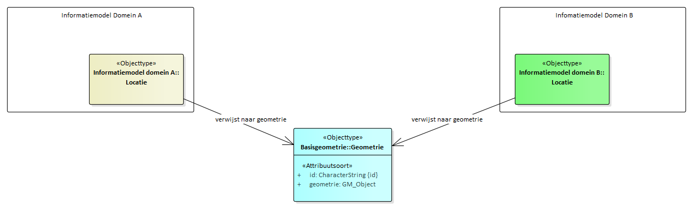

Informatiemodel
===============

inleiding
---------

In dit hoofdstuk wordt aan de hand van een UML-klassediagram en een
objectcatalogus de informatieinhoud en -structuur van model Basisgeometrie
beschreven.

UML diagram
-----------

Het model Basisgeometrie bevat maar één objecttype: Geometrie.

Objectcatalogus
---------------

### Objecttype Geometrie

| **Naam**        | Geometrie                                                                                                             |
|-----------------|-----------------------------------------------------------------------------------------------------------------------|
| **Definitie**   | Geometrie is het object dat de geometrie bevat: de geometrische bepaling van een locatie door middel van coördinaten. |
| **Toelichting** |                                                                                                                       |

### Attribuutsoort id

| **Naam**       | id                   |
|----------------|----------------------|
| **Definitie**  | Unieke identificatie |
| **Waardetype** | CharacterString      |
| **Herkomst**   | Basisgeometrie       |

Voorbeeld
---------

Het volgende UML diagram geeft een voorbeeld waarin twee domeinmodellen Domein A
en Domein B van uit een objecttype Locatie verwijzen naar een gemeenschappelijk
geometrie objecttype.

De geometrie is daarbij een eigenschap van de locatie-objecten uit de twee
domeinmodellen

