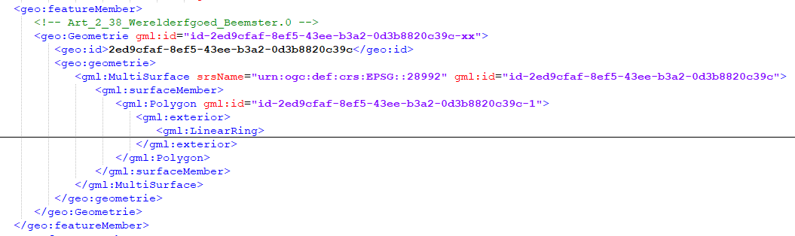

Gegevensuitwisseling en -publicatie
===================================

Leveringsmedium
---------------

Niet gedefinieerd voor deze toepassing. Is bepaald door de toepassing van het
informatiemodel dat de Basisgeometrie toepast.

Formaten (encodings)
--------------------

De volgende encoding formaten zijn besckibaar

### GML

Beschikbaar GML applicatieschema Basisgeometrie.xsd gepubliceerd op: TODO

Nadere specificaties:

GML versie: GML 3.2.1 – SF-2

Het is verplicht om de srsName in te vullen. Invulinstructie:

-   Als gekozen voor RD stelsel: srsName="urn:ogc:def:crs:EPSG::28992"

-   Als gekozen voor ETRS89: zie ETRS89 specificatie.

Voor implementatie in GML zijn er aanvullende specificaties als het gaat om het
invullen van de (verplichte) gml:id. Dit veld is verplicht vanwege de GML 3.2.1.
specificatie. Elke geometrie (GML) krijgt daarom een \<gml:id\>. Dit gml:id
heeft geen informatiewaarde maar is nodig om interne en externe referenties te
realiseren voor geo-toepassingen.

**Invulinstructie:** de in een GML-bestand opgenomen geo:id is een globaal
unieke identifier (GUID). De losse ID’s van de bijbehorende gml:id’s worden
gevuld op basis van het geo:id inclusief een prefix van \<id-\> en na het geo:id
komt er nog een volgnummer. In de onderstaande afbeelding wordt weergeven hoe
dit er uitziet (tevens is dit te zien in een GML fragment).

Zie in de bovenstaande afbeelding dat geo:id de GUID bevat die meegegeven wordt
aan de geometrie. De volgende regels zijn van toepassing voor de verdere ID’s:

| **element**                 | **Regel voor ID**              | **voorbeeld**                             |
|-----------------------------|--------------------------------|-------------------------------------------|
| gml:id van Geometrie-object | GUID                           | 2ed9cfaf-8ef5-43ee-b3a2-0d3b8820c39c      |
| gml:id van geometrietype    | “id-”+ GUID + “-” + volgnummer | id-2ed9cfaf-8ef5-43ee-b3a2-0d3b8820c39c-1 |

**Nauwkeurigheid van coördinaten.**

De nauwkeurigheid van de coördinaten opgenomen bij een geometrie moet minstens
de nauwkeurigheid realizeren die vermeld wordt in het informatiemodel of
bijgeleverde inwinningseisen. Meestal is het aantal decimalen dat in software
standaard wordt opgeleverd groter. Deze decimalen hebben dan geen betekenis
meer. Om te voorkomen dat er te grote databestanden ontstaat wordt aanbevolen de
coordinaten af te ronden op 1 millimeter of het equivalent daarvan in graden.

**Aanbeveling:**

Coordinaten opgenomen bij een geometrie worden standaard uitgewisseld met een
getalsnauwkeurigheid van 1 mm of het equivalent daarvan in graden. Voor RD,NAP
en ETRS89 komt dat overeen met de volgende nauwkeurigheden:

RD in meters 3 decimalen (1 mm);  
NAP-hoogte in meters 3 decimalen (1 mm);  
ETRS89-breedte in graden 8 decimalen (1,1 mm);  
ETRS89-lengte in graden 8 decimalen (0,7 mm);  
ETRS89-hoogte in meters 3 decimalen (1 mm).

Alles wat nauwkeuriger is wordt afgerond op deze nauwkeurigheid van 3 of 8
decimalen. Afronding is volgens de volgende regel 0.0015 -\> 0.002; 0.0014 -\>
0.001.
