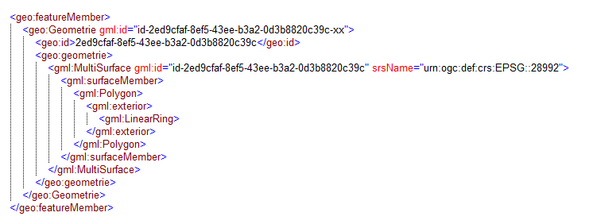

Gegevensuitwisseling en -publicatie
===================================

Leveringsmedium
---------------

Het medium waarmee de data worden geleverd is niet gedefinieerd op dit niveau. Het wordt bepaald door de toepassing van het informatiemodel dat de Basisgeometrie toepast.

Formaten (encodings)
--------------------

De volgende encodingformaten zijn beschikbaar:

### GML

Beschikbaar GML applicatieschema Basisgeometrie.xsd gepubliceerd op:
https://register.geostandaarden.nl/gmlapplicatieschema/basisgeometrie/

**Nadere specificaties:**

**GML versie en profiel:** GML 3.2.2 – SF-0.  
Simple features profile 0 is gekozen omdat de inhoud van dit model geen
constructies heeft die complexer zijn dan SF-0. Voor geometrietypen is er tussen
SF-0, SF-1 en SF-2 geen verschil. Over de data gekoppeld aan dit geometriemodel
wordt niets gezegd. Die hebben hun eigen comlexiteitseisen.

**Coordinaatrefrentiestelsel:** Het is verplicht om de srsName in te vullen op het hoogste niveau van een geometrie. Dat betekent dat van een samengestelde geometrie, een multigeometrie, alleen op het niveau van de samenstelling de srsName verplicht is ingevuld. 

Invulinstructie:

-   RD stelsel (2D): srsName="urn:ogc:def:crs:EPSG::28992"

-   RD-NAP (3D): srsName="urn:ogc:def:crs:EPSG::7415"

-   ETRS89 (2D): srsName="urn:ogc:def:crs:EPSG::4258"

-   ETRS89 (3D): srsName="urn:ogc:def:crs:EPSG::4937"

-   ETRS89 + EVRF2007 (NAP)(3D): srsName="urn:ogc:def:crs:EPSG::7423"

De beschrijving van de respectivelijke EPSG codes zijn te vinden onder de url's met het format "www.opengis.net/def/crs/EPSG/0/epsgcode". Bijvoorbeeld: http://www.opengis.net/def/crs/EPSG/0/28992

**GML:id:** Voor implementatie in GML zijn er aanvullende specificaties als het
gaat om het invullen van de \<gml:id\>. De \<gml:id\> heeft geen
informatiewaarde maar is nodig om interne en externe referenties te realiseren
voor geo-toepassingen. Voor de GML 3.2.1 was dit een verplicht
element maar voor GML 3.2.2 is dit optioneel. Voor de implementatie van de
verwijzing naar de geometrie-objecten moet de \<gml:id\> voor het
geometrie-object ingevuld zijn. Elk geometrie-object krijgt daarom een
\<gml:id\>. Voor het geometrietype zelf geldt dat de \<gml:id\> op het hoogste
niveau van de geometrie van het type verplicht is ingevuld.

**Invulinstructie:** de in een GML-bestand opgenomen geo:id is een globaal
unieke identifier (GUID). De losse ID’s van de bijbehorende gml:id’s worden
gevuld op basis van het geo:id inclusief een prefix van \<id-\>. In onderstaand GML-fragment wordt weergeven hoe dit er uitziet.

Zie in bovenstaande fragment dat geo:id de GUID bevat die meegegeven wordt
aan de geometrie. De volgende regels zijn van toepassing voor de verdere ID’s:

| **element**                 | **Regel voor ID**   | **voorbeeld**                              |
|-----------------------------|---------------------|--------------------------------------------|
| geo:id van Geometrie-object | GUID                | 2ed9cfaf-8ef5-43ee-b3a2-0d3b8820c39c       |
| gml:id van Geometrie-object | “id-”+ GUID + “-xx” | id-2ed9cfaf-8ef5-43ee-b3a2-0d3b8820c39c-xx |
| gml:id van geometrietype    | “id-”+ GUID         | id-2ed9cfaf-8ef5-43ee-b3a2-0d3b8820c39c    |

Nauwkeurigheid van coördinaten.
-------------------------------

De nauwkeurigheid van de coördinaten opgenomen bij een geometrie moet minstens
de nauwkeurigheid realiseren die vermeld wordt in het informatiemodel of
bijgeleverde inwinningseisen. Meestal is het aantal decimalen dat in software
standaard wordt opgeleverd groter. Deze decimalen hebben dan geen betekenis
meer. Om te voorkomen dat er te grote databestanden ontstaan wordt aanbevolen de
coördinaten af te ronden op 1 millimeter of het equivalent daarvan in graden.

**Aanbeveling:**

Coordinaten opgenomen bij een geometrie worden standaard uitgewisseld met een
getalsnauwkeurigheid van 1 mm of het equivalent daarvan in graden. Voor RD,NAP
en ETRS89 komt dat overeen met de volgende nauwkeurigheden:

RD in meters 3 decimalen (1 mm);  
NAP-hoogte in meters 3 decimalen (1 mm);  
ETRS89-breedte in graden 8 decimalen (1,1 mm);  
ETRS89-lengte in graden 8 decimalen (0,7 mm);  
ETRS89-hoogte in meters 3 decimalen (1 mm).

Alles wat nauwkeuriger is wordt afgerond op deze nauwkeurigheid van 3 of 8
decimalen. Afronding is volgens de volgende regel 0.0015 -\> 0.002; 0.0014 -\>
0.001.
